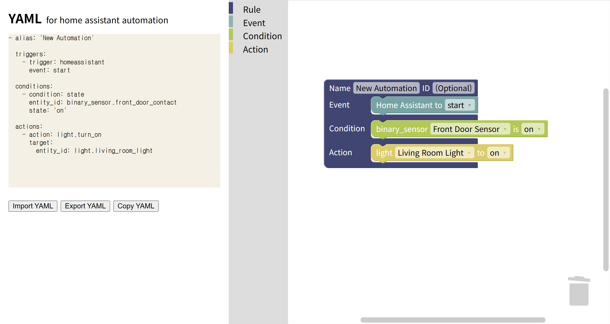

# SmartBlock HA
**Visual Editor for Home Assistant Automations**

SmartBlock HA is a Blockly-based visual editor for Home Assistant automations.  
It supports round-trip editing between YAML and visual blocks so users can:

- create automations visually
- import existing Home Assistant automation YAML
- inspect normalized import data
- export valid automation YAML
- push and pull automations from Home Assistant



## Overview
Home Assistant automations are typically written in YAML with **triggers**, **conditions**, and **actions**.  
SmartBlock HA provides a visual editing workflow on top of that model:

`YAML -> Visual Blocks -> YAML`

The editor is designed for practical round-trip use:

- supported YAML is converted into structured Blockly blocks
- unsupported or partial syntax is preserved through raw fallback handling
- imported automations can be edited and exported again

## Key Features
- Visual editor for Home Assistant triggers, conditions, and actions
- Round-trip editing between YAML and Blockly blocks
- Import normalization with fallback preservation for unsupported syntax
- Home Assistant automation pull and push support
- Conflict Analyzer (E-A) integration
- Automation Regression Test workflow for batch verification
- Alias-based automatic `id` generation when pushing automations without an `id`

## Project Structure
The application now runs directly from the repository root.

```text
src/                  frontend UI, Blockly setup, import/export logic
server/               analyzer bridge server
test/                 Task Alt / regression datasets and utilities
webpack.config.js     local dev server and proxy setup
package.json          app dependencies and scripts
```

## Local Setup
Clone the repository, move to the project root, and install dependencies:

```bash
npm install
```

Start the local development server:

```bash
npm run start
```

Build a production bundle:

```bash
npm run build
```

## Environment Variables
To use Home Assistant integration features, create a local `.env` file in the project root.

Example:

```env
HA_BASE_URL=http://<HA_IP>:8123
HA_TOKEN=<YOUR_LONG_LIVED_TOKEN>
```

Optional variables:

- `HA_IP`
- `HA_PORT`
- `ANALYZER_HOST`
- `ANALYZER_PORT`
- `DEV_SERVER_HOST`
- `HA_SSL_VERIFY`

Notes:

- `.env` is ignored by git and must be created locally
- if `.env` is missing, the visual editor still works, but HA pull/push and analyzer features are unavailable
- do not expose the local dev server publicly while using `HA_TOKEN`

## Home Assistant Integration
SmartBlock HA can interact with a running Home Assistant instance.

Supported workflows:

- load automations from Home Assistant
- import an automation into the Blockly workspace
- export the current workspace as YAML
- save the current automation back to Home Assistant

If an automation `id` is missing, SmartBlock HA generates one automatically using:

```text
sb_<alias_slug>_<short_suffix>
```

The generated `id` is written back into the workspace so later saves update the same automation.

## Conflict Analyzer (E-A)
UI entry: `🛠`

The analyzer reports summary information such as:

- automations analyzed
- events
- actions
- rule edges
- inconsistency issues
- conflict types
- conflicting entities
- elapsed time

If no conflicts are detected, the UI reports:

```text
No inconsistency detected.
System logic is consistent.
```

To use the analyzer backend directly:

```bash
node server/analyze_server.js
```

Requirements:

- Python 3
- PyYAML
- analyzer script at `src/homeassistant/conflict_analyzer/ha_eca_conflict_analyzer.py`
- external analyzer reference: <https://github.com/kwanghoon/haanalyzer>

## Automation Regression Test
UI entry: `⛏`

This workflow is used for dataset-based verification of YAML import/export behavior.

- import YAML files in batch
- preview original and regenerated results
- open a selected preview in the editor
- record a baseline and run regression checks

Datasets are stored under `test/`.

## Security Notes
- the dev server and analyzer are intended for local use
- do not expose the dev server publicly when using `HA_TOKEN`
- if LAN access is required, set `DEV_SERVER_HOST=0.0.0.0` and add your own access controls

## Demo Video
<https://youtu.be/jua_SjaCClo?si=6nmnx814JoCcibmV>
