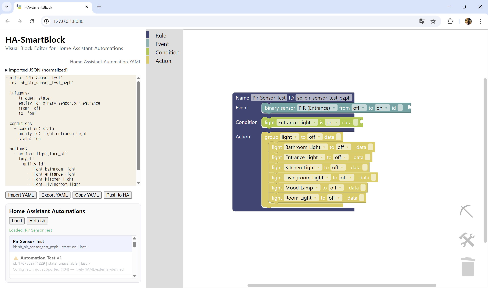

# HA-SmartBlock
**An ECA(Event-Condtion-Action)-Based
Visual Block System for Home Assistant**

## Home Assistant
[Home Assistant](https://www.home-assistant.io/) is a widely used open-source home automation platform.   
It enables users to automate smart devices through YAML-based automation scripts that combine **triggers**, **conditions**, and **actions**.

However, YAML syntax requires users to handle indentation, nested logic, and strict formatting —  
which can make automation difficult for end users.

## Overview
**HA-SmartBlock** extends the idea of [*Smart Block (for SmartThings)*](https://github.com/baknayeon/smartblock) to the **Home Assistant** environment.  
It allows users to **create and edit automations visually** without writing YAML code manually.

When users build their automations with blocks,  
the system automatically generates valid Home Assistant YAML code,  
and conversely, users can import existing YAML files to view and modify them as visual blocks.

Thus, **HA-SmartBlock provides a true round-trip editing environment**:  
YAML ⇄ Visual Blocks ⇄ YAML.



## Key Features
- Visual block editor for Home Assistant triggers, conditions, and actions
- Bidirectional transformation between YAML and visual blocks
- Import normalization with fallback preservation for unsupported syntax
- Home Assistant integration for automation import/export
- Automation conflict detection and analysis
- Regression testing workflow for validating block-system extensions

## Getting Started
### Clone Repository
To run the **HA-SmartBlock** program locally, first download or clone this repository from GitHub.  
After extracting or cloning the files, open a terminal (PowerShell or VS Code terminal) and navigate to the project root: `/HA_smartblock`.

~~~bash
git clone <repository_url>
~~~


### Environment Variables (for Home Assistant Integration)
To enable integration with your Home Assistant instance,
create a local `.env` file in the project root before starting the program.

Example:
~~~env
HA_BASE_URL=http://<HA_IP>:8123
HA_TOKEN=<YOUR_LONG_LIVED_TOKEN>
~~~

Notes:
- `.env` is ignored by git and must be created locally
- if `.env` is missing, the visual block editor remains functional, but Home Assistant integration features are disabled
- do not expose the local dev server publicly while using `HA_TOKEN`

### Install and Run
Install dependencies and launch the program:
~~~bash
npm install
npm run start
~~~

## Home Assistant Integration
HA-SmartBlock can interact with a running Home Assistant instance.

Supported workflows:
- load automations from Home Assistant
- import an automation into the Blockly workspace
- export the current workspace as YAML
- save the current automation back to Home Assistant

If an automation `id` is missing, HA-SmartBlock generates one automatically using:

```text
sb_<alias_slug>_<short_suffix>
```

The generated `id` is written back into the workspace so later saves update the same automation.

Live pull/push requires HA credentials:
- Set `HA_BASE_URL` or `HA_IP` / `HA_PORT`
- Set `HA_TOKEN`

## Conflict Analyzer
UI entry: `🛠`

The conflict analyzer detects potential redundancy, inconsistency, and circularity conflicts among Home Assistant automations.

The analyzer reports summary information such as:
- automations analyzed
- events
- actions
- rule edges
- inconsistency issues
- conflict types
- conflicting entities
- elapsed time

If no conflicts are detected, the UI reports:

```text
No inconsistency detected.
System logic is consistent.
```

To use the analyzer backend directly:

~~~bash
node server/analyze_server.js
~~~

- Python analyzer: `src/homeassistant/conflict_analyzer/ha_eca_conflict_analyzer.py`
- Requires Python 3 and PyYAML
- [Analyzer Repository](https://github.com/kwanghoon/haanalyzer)

## Regression Verification
UI entry: `⛏`

The regression workflow helps ensure backward compatibility and semantic stability when extending the block system by verifying that newly added blocks or conversion logic changes do not introduce unintended side effects on existing automation assets.

Features include:
- Batch verification using Home Assistant automation datasets
- Baseline generation and comparison against regenerated YAML outputs
- Automated detection of unexpected structural and semantic changes
- Regression reports highlighting status, counts, and structural differences
- Baseline management through the local development server API

- Datasets: `test/test_*`
- Note: Regression datasets are large and intended primarily for verification and testing purposes.


## Security Notes
- Dev server and analyzer are local-only by default.
- Do not expose the dev server publicly when using `HA_TOKEN`.
- If LAN access is required, set `DEV_SERVER_HOST=0.0.0.0` and add your own access guard.

## Demo Video
[Watch the Demo Video](https://youtu.be/_tS3Mm9kdRk)
